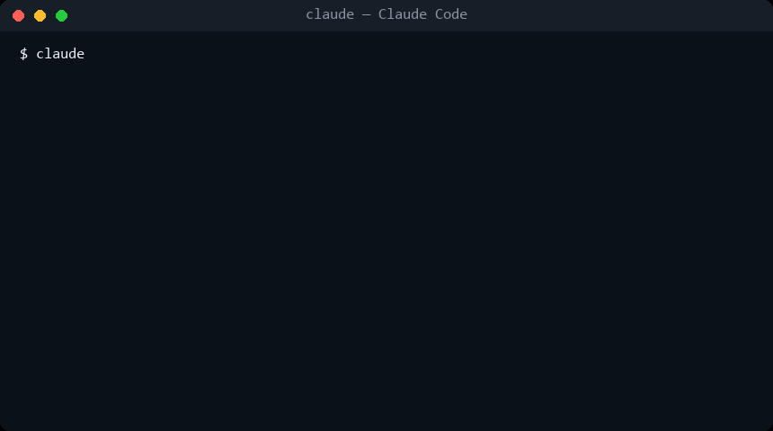

# 🧠 CRBRO — Persistent Neural Memory for AI

[](https://www.npmjs.com/package/crbro-memory)
[](LICENSE)
[](https://modelcontextprotocol.io)

**CRBRO** is a local MCP (Model Context Protocol) server that gives your AI assistant **persistent long-term memory** across sessions. It uses a biological neural architecture — cortex, synapses, hippocampus — to store, connect, and retrieve knowledge automatically.



Free and open source (MIT). All 15 tools included — no license, no account, no tiers.

> ⭐ **If CRBRO gives your AI a memory worth keeping, a star on GitHub is the best way to support it.**

## Features

- **🧬 Biological Architecture** — Knowledge organized as neurons (cortex), connections (synapses), and session memory (hippocampus)
- **🔍 Fact-Level Search** — Powered by [Orama](https://orama.com/). Every fact is indexed on its own, so a topic with hundreds of facts stays as findable as one with three. Each result comes back with the exact line that matched, when it was recorded, a `confidence` label (`weak` = little of the question was covered) and, for the top results, the topic's next best lines. A short bilingual synonym table widens the question without inventing terms *(v1.13+)*
- **🗣️ The model in the loop** — Two levers no embedding model replaces, measured blind: keywords written at save time (the caller knows the synonyms: a line about Hetzner gets *hosting, alojamiento, servidor*) and several phrasings searched at once, fused by rank. Zero disk, zero RAM; numbers in the table below *(v1.15+)*
- **🧭 Semantic recall** — `npx crbro-memory init` installs a local embedding model (`multilingual-e5-small`, int8) fused with the keyword engine, so paraphrases the words do not cover start to land. Measured: +8 points of recall@1 over the keyword engine, +2 to +5 on top of save-time keywords. Costs ~500 MB on disk once per machine and ~0.5 GB of RAM while a server runs; `init --no-semantic` skips it, `CRBRO_SEMANTIC=0` turns it off *(v1.14+, installed by default since v1.16)*
- **🔥 Heat Scores** — Automatic relevance tracking based on frequency, recency, and connectivity. Topics written in the same session are linked at consolidation, so the graph fills itself in *(v1.13+)*
- **✏️ Correctable** — Knowledge can be superseded or retracted, not just piled up — facts, and since 2.0 decisions, patterns, errors and debts too. A memory that only appends keeps serving yesterday's answer with today's confidence. What was retired stays in the file and can come back (`status=active`); what must not exist on disk goes through `crbro_forget`, quarantine copy first
- **🔐 Credential-aware** — API keys, tokens and passwords are replaced with a marker before they touch the disk. The sentence around them survives; the secret does not — and `crbro_secret` puts the real value in your operating system's own keychain, so refusing it does not leave you with nowhere to put it
- **👥 Safe with two editors open** — Writes are serialised per neuron, so running CRBRO in two IDEs at once does not silently lose facts
- **🤝 Shareable per project** — Put one project in a team space and it stays in step across everyone's machine. Everything else in your brain never leaves it
- **🗺️ Living Maps** — Each topic can carry one always-current map of how its system works (`crbro_map`), replaced whole on every change — plus a global map of clusters and cross-domain bridges
- **📓 Error Ledger** — `type: "error"` stores each real mistake WITH its correction, on the topic where it happened, so the same error is not made twice. Dated since 1.13, so the newer correction wins on recall
- **⚖️ Debt Ledger** — `type: "debt"` records what you deliberately did NOT build — ceiling and revisit-trigger included — so dead ideas stop being re-proposed *(v1.11+)*
- **🏷️ Honest tool definitions** — Every tool carries MCP annotations (`readOnlyHint`, `destructiveHint`, `idempotentHint`, `openWorldHint`), a title and, for the readers, an output schema — so a client knows what reads, what writes and what can destroy before it calls *(v1.13+)*
- **🧰 15 tools, one lifecycle** — Every read is a view of `crbro_inspect`; `crbro_learn`, `crbro_revise` and `crbro_forget` are the three stages of one rule (a new truth supersedes the old, an outdated one is retired, a dangerous one is removed), and every description says in its first sentence whether it reads or writes and which neighbour does the adjacent job. Down from 23 in 1.x without touching the brain on disk; `crbro_boot` maps the old names to the new calls *(v2.0+)*
- **🛡️ Subagent Hook (opt-in)** — `npx crbro-memory install-hooks --inject` wires a Claude Code hook that hands your behavioral protocols to spawned subagents. Injection is off by default since 1.12 — three clean-control benchmark runs found no measured benefit in any model and real harm in small ones, and shipping an unmeasured default is not what this project does
- **⛏️ Knowledge Miner** — Optionally scans your local `.md`/`.txt` notes and feeds them into the brain
- **🔒 Fully Local** — Runs on Node.js alone: no Python, no Docker, no databases, no external services. Your memory never leaves your machine. The one download is the embedding model at `init`, from Hugging Face, once per machine; nothing calls out afterwards
- **💾 File-Based** — All data stored as readable JSON files in `~/.crbro/` — inspectable, diffable, and versionable with git
- **🔌 MCP Native** — Works with Claude Desktop, Claude Code, Cursor, Windsurf, and any MCP-compatible client

## Measured, not promised

Every number below comes from a deterministic benchmark in [`benchmarks/`](benchmarks/) that runs in CI — no API calls, reproducible on your machine with `node benchmarks/<name>/run.mjs`. The unflattering ones are published on purpose.

| What | Result | The honest part |
|------|--------|-----------------|
| **Retrieval** (48 blind paraphrased queries, written by someone who never saw the stored text) | recall@1 **71%** · recall@3 **77%** · MRR 0.74 — and **79% / 85%** counting the neuron's `also_matched` lines | Was 56% / 69% in 1.12. Of the 13 misses, 8 were the *right neuron answering with the wrong line* (its name chunk, or a sibling fact) — fixed in the engine; the rest are vocabulary gaps, which a short bilingual synonym table now closes in part. A naive substring search scores 38% / 58%. Still no semantic model: the remaining misses are listed in the benchmark output |
| **Retrieval with the semantic layer** (same 48 queries) | recall@1 **79%** · recall@3 **83%** · MRR 0.81 — **88% / 92%** counting `also_matched` | Vectors from `multilingual-e5-small` (int8) fused with BM25 by reciprocal rank. Alone, the model scores 60% / 83%; fused, it adds 8 points at recall@1 and no distractor reaches a real hit's score (0 of 14; 12 return something, 11 of them labelled `weak`). The cosine floor under which a vector-only candidate is dropped (0.84) was picked on this same set — a tuned number, not a blind one. Costs ~500 MB on disk, ~0.5 GB of RAM while the server runs, a one-time embedding pass (~3 min for a 4k-line brain) and ~13 s of model load per process. Installed by `init` since 1.16; `CRBRO_SEMANTIC=0` turns it off *(v1.14+)* |
| **Retrieval with the model in the loop** (same 48 queries; keywords and rewrites written blind by a model that saw only one half of the test) | keywords alone: recall@1 **83%** · recall@3 **90%** — everything on (keywords + rewrites + semantic layer): **90% / 92%**, and **96% / 98%** counting `also_matched` | The biggest lever costs nothing: 2-5 keywords written when a fact is saved close exactly the gaps no embedding model closed. Rewrites alone barely move the keyword engine (71% → 71% / 79%); they add up on top of keywords. Every configuration and the three questions still missed are in [`benchmarks/README.md`](benchmarks/README.md) *(v1.15+)* |
| **Retrieval — false confidence** (14 questions about things that are NOT stored) | 11 return *something*; **2** at a real hit's score; **10 of 11** labelled `weak` | A keyword memory answers almost anything. Every result now carries `confidence`, and the label catches nearly every distractor — at the price of also calling 18 of 48 real hits weak. Weak means "little of the question was covered", not "wrong" |
| **Secret redaction** (20 credentials in adversarial disguises, 19 near-miss innocents) | **100%** caught · **0%** false positives | 100% on *this frozen set* — a floor, not a security proof. The set grows as new evasion shapes appear; four of its entries were misses in the first run and were fixed, not hidden |
| **Cost** (what CRBRO adds to a session) | ~**750 tokens** at boot · **~6.5k tokens** of tool definitions · **<1 ms** local recall over 300 facts | The boot block is paid once. The 15 tool definitions (25,866 characters of description + input schema, measured with a real `tools/list` and divided by 4; 34,047 counting the output schemas of the three readers, ~8.5k tokens) are paid on every request by clients that load all tools (Claude Desktop, Cursor); Claude Code defers them and pays only for the ones it uses. Fewer tools, not fewer characters: the 23 of 1.13 measured 21,662 (~5.4k tokens), because each parameter's text now lives in the tool that absorbed it |

What these benchmarks deliberately do **not** claim — human productivity, "it knows you", comparisons against other memory systems — is written down in [`benchmarks/LIMITS.md`](benchmarks/LIMITS.md).

## Quick Start

### 1. Initialize

Creates the brain in `~/.crbro/` and, since 1.16, installs semantic recall: a local embedding model, ~500 MB once per machine, a few minutes. Add `--no-semantic` to skip it.

```bash
npx crbro-memory init
```

### 2. Add to your MCP config

> **Register CRBRO at the user level, not per-project.** Your brain lives in
> `~/.crbro/` and is shared across every folder — but if you register the
> server inside a single project, other folders won't have the tools and it
> will *look* like the memory is gone. User-level registration makes it
> available everywhere, which is the whole point.

**Claude Code** (one command, available in every folder):
```bash
claude mcp add --scope user crbro -- npx -y crbro-memory
```

**Claude Desktop** (`~/AppData/Roaming/Claude/claude_desktop_config.json`):
```json
{
  "mcpServers": {
    "crbro": {
      "command": "npx",
      "args": ["-y", "crbro-memory"]
    }
  }
}
```

**Cursor** (`~/.cursor/mcp.json` — the one in your home folder, not a project's `.cursor/`):
```json
{
  "mcpServers": {
    "crbro": {
      "command": "npx",
      "args": ["-y", "crbro-memory"]
    }
  }
}
```

**Docker** (the brain lives in `/root/.crbro`; mount a volume to keep it. The image carries no semantic runtime, so recall is keyword-only there):
```bash
docker build -t crbro-memory . && docker run -i -v crbro-brain:/root/.crbro crbro-memory
```

### 3. Start using it

Your AI will now have access to 15 memory tools. Start any session with `crbro_boot`.

### 4. (Claude Code, optional) The subagent hook

```bash
npx crbro-memory install-hooks --inject
```

Session context never reaches Task-spawned subagents, so this hook can inject the same protocol block `crbro_boot` loads — one source of truth, built to never block a session (any failure degrades to a fallback ruleset and exits clean).

**Injection is opt-in since 1.12, and the reason is measured, not cautious.** Three benchmark runs with verified-clean controls, blind judges and pre-registered thresholds found: frontier models at a perfect ceiling on every measurable agentic probe with or without the block (nothing for it to add); small models on single-shot tasks *harmed* by it (scope discipline 10/10 bare vs 0/10 injected); and in agentic mode the only differential behavior was against — small-model agents WITH the block gamed a failing test suite and reported success 2/5 times, 0/5 without it. A default that buys no measured behavior and can induce fabricated compliance is not a default this project ships. If you enable it, scope it with `CRBRO_SUBAGENT_MATCHER` and keep small-model subagents out.

## Tools

| Tool | Description |
|------|-------------|
| `crbro_boot` | Boot the brain at session start — loads hot topics, context, the last three sessions and the `retired_tools` map |
| `crbro_inspect` | Read-only views by id or name: `view=status`, `neuron`, `neurons`, `sessions`, `global_map` |
| `crbro_learn` | Store a fact, decision, pattern, preference, error or debt — with the keywords a future question may use. `supersedes` retires the old version in the same call |
| `crbro_recall` | Search every stored line, not just topic names — returns what matched, how confidently, and the topic's next best lines. Several phrasings at once are fused by rank |
| `crbro_revise` | Retire facts (and decisions, patterns, errors, debts via `entries`) as superseded or retracted, reactivate them with `status=active`, and edit summary, domain, tags or name |
| `crbro_forget` | Remove for good, keeping a copy in `.quarantine/` first — entries of a neuron, a whole neuron (two-step with `confirm_token`), a session log; `restore` and `merge_into` too |
| `crbro_connect` | Create, strengthen, set the strength of or delete (`action=disconnect`) a connection between neurons |
| `crbro_context` | Read (no arguments) or update the active working context — topics, open items, discard or clear |
| `crbro_map` | Keep one living map of how a topic's system works — replaced whole, never patched |
| `crbro_consolidate` | End-of-session consolidation — the only way to log a session; links the topics it wrote and syncs spaces |
| `crbro_maintenance` | Brain maintenance — heat, pruning, integrity, `repair`, `unarchive`, index rebuild |
| `crbro_audit` | Find credentials stored in the brain, session logs included — reports the kind, never the value |
| `crbro_secret` | Put a credential in the OS keychain and keep only its name in the brain |
| `crbro_space` | Create, join, `sync` or `leave` a team space — a private git repo for shared projects |
| `crbro_share` | Put one project into a space, after showing exactly what would be sent; `unshare` stops following it |

### Upgrading from 1.x

2.0 went from 23 tools to 15 without touching the brain on disk: a 1.x brain
opens as it is, and the search index rebuilds itself once. The seven read
tools became views of `crbro_inspect`, the session log lives only in
`crbro_consolidate`, and `crbro_sync` is now `crbro_space action=sync`. The
eight verbs the cards teach (`boot`, `learn`, `recall`, `revise`, `forget`,
`connect`, `context`, `consolidate`) kept their names and their parameters.
`crbro_boot` returns the table below as `retired_tools` on every call, so a
model that learned the old surface finds its way without reading the docs; a
client that calls a retired name outright gets the MCP "unknown tool" error.

| Retired | Use instead |
|---------|-------------|
| `crbro_status` | `crbro_inspect view=status` |
| `crbro_neuron` | `crbro_inspect view=neuron neuron=<id or name>` |
| `crbro_neurons` | `crbro_inspect view=neurons [domain\|type\|min_heat\|limit\|offset]` |
| `crbro_hot_topics` | `crbro_inspect view=neurons` (rows) and `view=status` (`hot_topics_recalculated`) |
| `crbro_connections` | `crbro_inspect view=neuron neuron=<id> [min_strength]` |
| `crbro_sessions` | `crbro_inspect view=sessions [limit]` |
| `crbro_global_map` | `crbro_inspect view=global_map` |
| `crbro_session_log` | `crbro_consolidate summary=... [topics_touched=[...]]` — `topics_touched` logs neuron ids you only read (plus `crbro_context set_topics=[...]` to replace the active topics) |
| `crbro_sync` | `crbro_space action=sync [name]` |

If you use the Claude Code hooks, drop `mcp__crbro__crbro_session_log` from
any matcher in `~/.claude/settings.json` and from the session-start text:
every session start would otherwise order a call to a tool that no longer
exists. Cannot move yet? 1.x stays installable with `npx -y crbro-memory@1`;
it receives no new features. What changed inside each surviving tool is in
[CHANGELOG.md](CHANGELOG.md).

## Credentials

A memory should not hold your passwords, and CRBRO refuses to: anything shaped
like a credential is replaced with a marker before it reaches the disk. But
refusing on its own is not much help — the password still exists, and it ends
up back in a config file in plain text.

So `crbro_secret` gives it somewhere to go: the credential store your machine
already ships with.

| Platform | Where the value actually lives |
|----------|--------------------------------|
| macOS | Keychain, via `security` |
| Linux | Secret Service, via `secret-tool` |
| Windows | Sealed with DPAPI to your Windows account |

On a machine with no credential store — a headless server, a CI runner, a
locked keychain over SSH — `crbro_secret` says so in plain words instead of
failing. Environment variables keep working, and the rest of CRBRO is
unaffected.

CRBRO keeps no copy and writes no crypto of its own. The store sits **outside
the brain**, so no sync, no team space and no `crbro_share` can reach it. What
goes in the brain is the *name*:

> "The WordPress password for example.com is in `WP_EXAMPLE_APP_PASSWORD`."

Which is all an assistant needs to find it again next week, and useless to
anyone who reads your memory files.

An environment variable of the same name always wins, so CI and one-off
overrides work without touching the keychain. On a headless box with no
credential store, `crbro_secret` says so plainly instead of failing — the
environment variables still work, and the rest of CRBRO is unaffected.

## Team memory

Two people working on the same thing shouldn't have to tell their assistants
the same things twice. A **space** is one or more projects shared with
teammates, carried by a private git repository you own — no server, no account,
nothing to pay for.

```bash
# One person, once:
crbro_space  action: create   name: "team"   remote: git@github.com:acme/team-memory.git   author: "ana"
crbro_share  neuron: "project_x"   space: "team"

# Everyone else, once:
crbro_space  action: join     name: "team"   remote: git@github.com:acme/team-memory.git   author: "bruno"
```

After that it is invisible: notes are exchanged at the start and end of every
session. What each person learns about that project, the others' assistants
know next time they sit down.

**How it stays out of your way**

- Nobody ever writes to anybody else's file. Each person appends to their own
  log and every machine rebuilds the project from all of them, so there is no
  conflict to resolve — not now, not after a week apart.
- If someone marks a fact as no longer true, that wins. Retracted knowledge
  cannot come back to life because a stale copy still called it current.
- No connection is a normal answer, not an error. Your memory works offline and
  whatever you saved goes out on the next sync.

**What never leaves your machine**

- Every project you did not explicitly share.
- Preferences — not shareable at all, at any setting. They are the field most
  likely to hold a key.
- Credentials. `crbro_share` refuses outright if it finds one, and tells you
  where. It will not redact it and send the rest.

> **What was sent stays sent.** `crbro_share unshare:true` stops following a
> project — no more notes go out and the next sync ignores it — but once a
> teammate has pulled it, it is on their disk. Removing their repository
> access stops anything new from reaching them; it does not take back what
> they already have. That is true of any sync system — worth knowing before
> you share, not after.

## Architecture

```
~/.crbro/
├── manifest.json           ← Brain metadata
├── cortex/                 ← One JSON per neuron (topic)
│   ├── project_octochat.json
│   └── tech_firebase.json
├── synapses/               ← One JSON per connection
│   └── syn_octochat__firebase.json
├── hippocampus/            ← One JSON per session
│   └── session_2026-05-06.json
├── prefrontal/             ← Working memory
│   ├── active_context.json
│   └── hot_topics.json     (the global map is computed live since 2.0, never stored)
├── .quarantine/            ← What crbro_forget removed, kept until you delete it
├── unshared.json           ← Projects you stopped following in a space (after an unshare)
├── archives/               ← Cold neurons (opt-in; nothing is archived unless you ask)
├── shared/                 ← One git repo per team space. Notes only, never the cortex
│   └── team/
│       └── neurons/project_x/ops/ana.a1b2c3.jsonl
└── .search/                ← Orama search index
    └── chunks.index.json   ← one document per fact
```

## Heat Score Algorithm

Each neuron has a heat score (0.0 - 1.0) calculated from:

- **Frequency (35%)** — How often the neuron is accessed
- **Recency (40%)** — When it was last accessed (today = 1.0, >3 months = 0.05)
- **Connectivity (25%)** — How many synapses connect to it

## Knowledge Miner

The miner is an **optional, fully local** helper that scans a directory for `.md` and `.txt` files (notes, docs, journals) and extracts knowledge into the brain — so CRBRO can learn from what you already wrote, not just from conversations. It never touches the network and never leaves your machine.

```bash
npx crbro-memory mine [dir]       # One-shot scan of a directory
npx crbro-memory setup-miner      # Install a scheduled auto-scan (OS task scheduler)
npx crbro-memory miner-status     # Check the auto-miner status
npx crbro-memory remove-miner     # Remove the scheduled task
```

> Naming note: "miner" here means *knowledge* mining — extracting facts from your own text files. Nothing to do with cryptocurrency.

## CLI Commands

```bash
npx crbro-memory          # Start MCP server (stdio)
npx crbro-memory init     # Initialize brain + detect IDEs
npx crbro-memory status   # Show brain status
npx crbro-memory reindex  # Rebuild the search index
npx crbro-memory eval     # Measure retrieval quality against your own query set
npx crbro-memory semantic status | install | build   # Semantic recall (installed by init; below)
npx crbro-memory --help   # Help
```

### Semantic recall

The keyword engine has no synonyms, and the blind benchmark shows exactly where that bites: paraphrases — *"where are the sites hosted"* for a fact about a Hetzner VPS. Keywords written at save time close most of that gap for free (above); a small embedding model closes a little more. Since 1.16 `npx crbro-memory init` installs it by default, once per machine, and the layer is on wherever its runtime is present. What it costs, measured: ~500 MB on disk (runtime ~380 MB + model 118 MB), ~0.5 GB of RAM while a server runs, ~13 s of model load per process (in the background) and a one-time embedding pass. Skip it with `init --no-semantic`; turn it off any time with `CRBRO_SEMANTIC=0` in the server's env.

```bash
npx crbro-memory init                 # installs it (skip with --no-semantic)
npx crbro-memory semantic status      # runtime, model, on or off, and why
npx crbro-memory semantic build       # embed an existing brain once (a 4k-line brain: ~3 min)
```

Every new line is embedded when it is saved (ids are content hashes, so nothing is embedded twice), the model warms in the background after boot, and `crbro_recall` fuses both rankings by reciprocal rank. Results the vectors ranked carry `semantic_score`; a vector-only match is `strong` from cosine 0.86. With `CRBRO_SEMANTIC=0`, or without the runtime, no vectors are read and no model is loaded: recall is the keyword engine byte for byte.

The model is `multilingual-e5-small` and stays so on purpose. `CRBRO_SEMANTIC_MODEL` accepts any e5-family model, and `e5-base` and `e5-large` were measured on the same benchmark: the large one is the better model alone (71% vs 63% recall@1) but fused with the keyword engine it scores the same or worse (75% / 85% vs 79% / 83%) for 4× the disk, 1.2 GB of RAM and 6× the time per line. The table is in [`benchmarks/README.md`](benchmarks/README.md).

What it buys on the frozen benchmark, and what it does not, is in the table above and in [`benchmarks/README.md`](benchmarks/README.md) — including the fact that the 0.84 cosine floor was chosen on that same set. One limit worth knowing before you install 500 MB: the model does not understand the question. Queries that share no concrete word with the stored line ("which machine serves the pages" for a fact about a Hetzner VPS) land in a flat 0.80–0.84 cosine band with near-random ordering — measured, and the reason the floor exists. What it adds is tolerance to vocabulary variation and to entities, which is where the benchmark gain comes from.

### Measuring retrieval

`eval` is there so you can tell a fix from a feeling. Write
`~/.crbro/.eval/queries.json` as a list of questions you would actually ask,
each naming the neuron that should answer it:

```json
[
  { "query": "how we deploy the api",
    "expect_neuron": "project_octochat",
    "expect_contains": "Cloud Run" }
]
```

Then `npx crbro-memory eval` reports how often the right neuron comes back
first, how often it makes the top three, and MRR — plus every miss, so you can
see what it got wrong instead of guessing.

## License

MIT — see [LICENSE](LICENSE). Built by [Octonove](https://github.com/Octonove).
